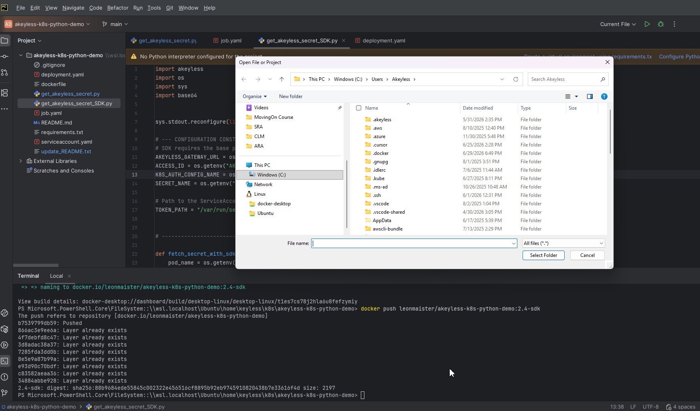

# Akeyless Kubernetes Authentication & Secret Retrieval (Python SDK)

### 🎯 Project Goal
**The goal of this project is to demonstrate how the **keyless** Akeyless Kubernetes Authentication method works using the official Python SDK. It covers everything from namespace creation to detailed Identity Sub-Claims verification.**

### 🧩 Process Decomposition

#### Phase 1: Deployment & Infrastructure
1. **Namespace & Identity**: A dedicated namespace and ServiceAccount are created to provide a secure boundary.
2. **Image Pull**: Kubernetes pulls the Python-based Docker image (SDK v2.4+) from the registry.
3. **Pod Initialization**: A Kubernetes Job orchestrates the Pod, mounting the ServiceAccount token automatically.
4. **Security Context**: Kyverno or native K8s policies ensure the Pod meets resource limits and security standards.

#### Phase 2: Application Logic (SDK Flow)
1. **Token Retrieval**: The script reads the JWT token from `/var/run/secrets/kubernetes.io/serviceaccount/token`.
2. **SDK Handshake**: The app uses `akeyless.V2Api` and Base64-encoded K8s token for authentication.
3. **Identity Verification**: The script calls `describe_sub_claims()` to inspect the JWT claims validated by the Gateway.
4. **Secret Access**: Upon successful auth, the SDK fetches the secret value directly into the app memory.

## 📂 File Descriptions
| File | Function |
| :--- | :--- |
| get_akeyless_secret_SDK.py | Logic using Akeyless Python SDK v2.3+. |
| serviceaccount.yaml | Identity for the Pod (ServiceAccount). |
| job.yaml | Kubernetes Job manifest with resource limits. |
| dockerfile | Builds the container (Recommended: use -u flag for unbuffered logs). |

## 👩‍💻 For Developer

### Local Testing & Development (PyCharm on Windows)
To open and debug this project locally in PyCharm on Windows:

\

1. Open **PyCharm** on your Windows machine.
2. Navigate to **File** -> **Open** from the top menu.
3. In the file browser, specify the network path to your project folder:
   ```text
   \\wsl.localhost\Ubuntu\home\keyless\k8s\akeyless-k8s-python-demo
   ```

### Build and Push the Image
```bash
docker build -t leonmaister/akeyless-k8s-python-demo:2.4-sdk .
docker push leonmaister/akeyless-k8s-python-demo:2.4-sdk
```

## 🖥️ Demo UI (Configuration Overview)
Before running the code, demonstrate the Akeyless configuration in the Console:
1. **Auth Method**: Locate the K8s Auth Method with ID: `p-kmx8x116z7j9km`.
2. **Advanced Configuration**: Explain the key security settings:
   - **Allowed Client Types**: Highlight this security sub-layer that defines which entities are trusted (CLI, SDK).
   - **Namespace Restriction**: Use our target namespace `akeyless-k8s-python-demo` as a prime example of how to restrict authentication to specific namespaces or service accounts.

## 🚀 Quick Start Guide

### 1. Environment Setup
```bash
# Create namespace
kubectl create namespace akeyless-k8s-python-demo --dry-run=client -o yaml | kubectl apply -f -

# Apply ServiceAccount
kubectl apply -f serviceaccount.yaml
```

### 2. Run Job
```bash
kubectl apply -f job.yaml
```

### 3. Verify and View Logs
Use this command to see full logs including headers and Sub-Claims for the latest Job pod:
```bash
kubectl logs $(kubectl get pods -n akeyless-k8s-python-demo -l job-name=akeyless-retrieval-job --sort-by=.metadata.creationTimestamp -o jsonpath='{.items[-1].metadata.name}') -n akeyless-k8s-python-demo
```

### 🔄 Rerunning the Job
To run the secret retrieval again, you must delete the previous Job:
```bash
kubectl delete job akeyless-retrieval-job -n akeyless-k8s-python-demo
kubectl apply -f job.yaml
```

## ⚙️ Akeyless Configuration
Ensure your Akeyless K8s Auth Method trusts:
- **Namespace**: `akeyless-k8s-python-demo`
- **ServiceAccount**: `akeyless-python-sa`

---
**Maintained by**: [leon-maister](https://github.com/leon-maister)

<sub style="color: gray;">/home/keyless/k8s/akeyless-k8s-python-demo | CS-EKS</sub>
